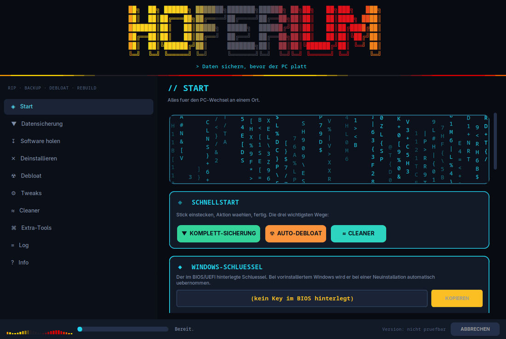
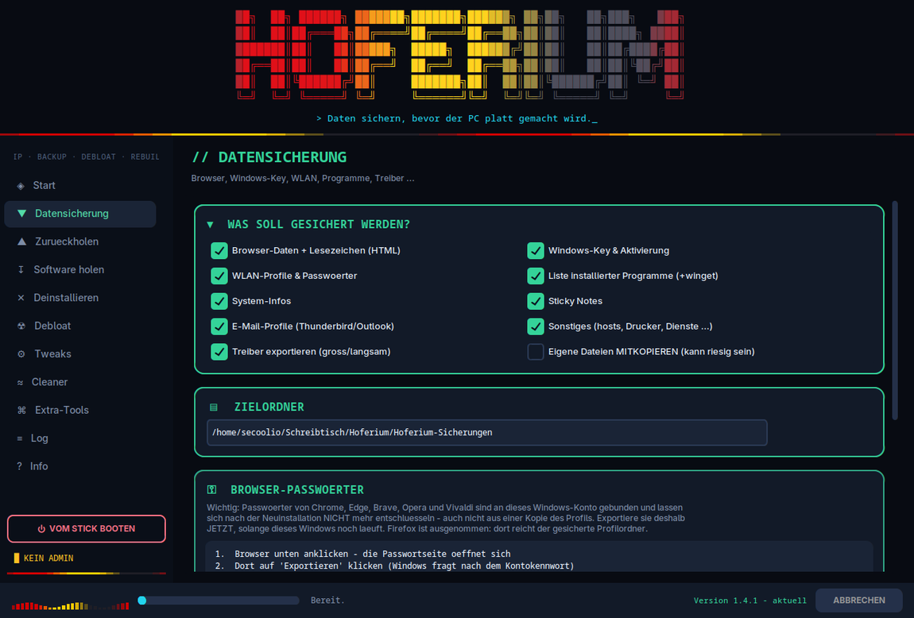
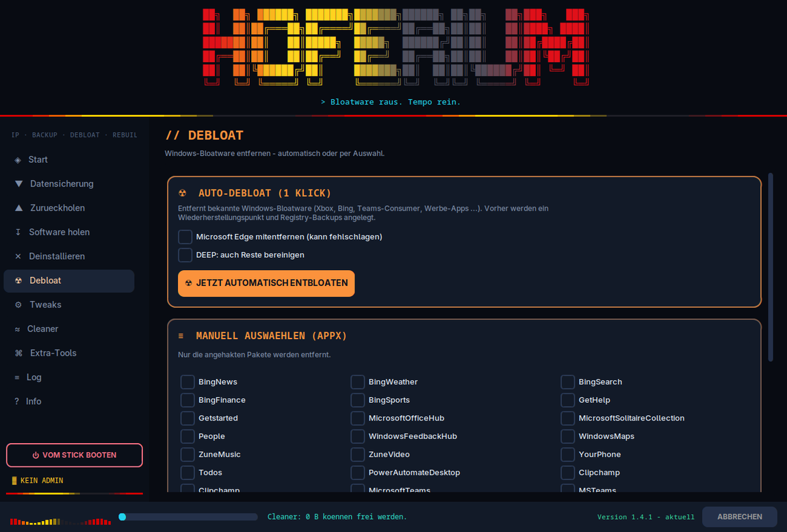
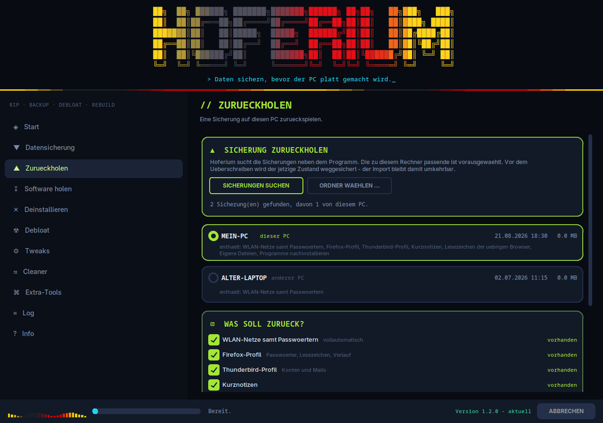
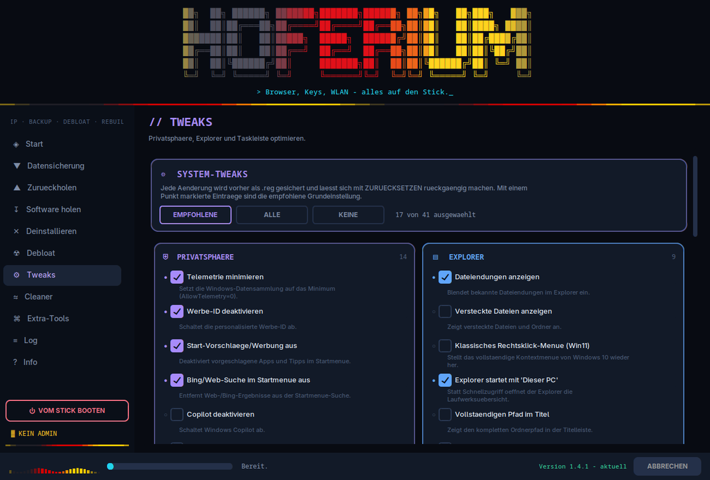
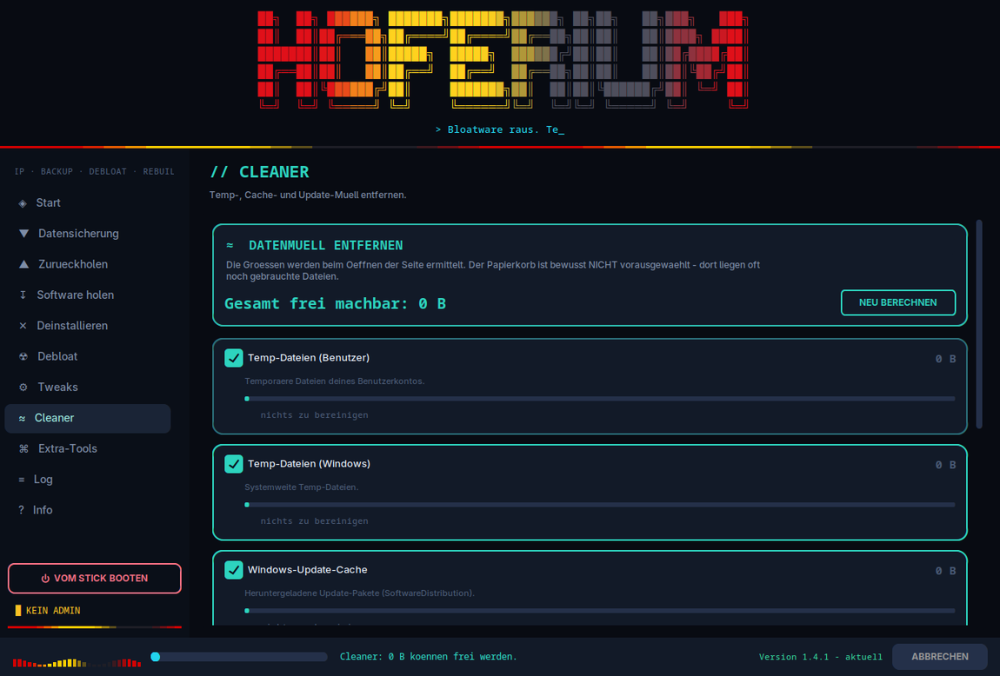

<div align="center">

# Hoferium

**Windows-PCs neu aufsetzen, ohne vorher stundenlang Daten zusammenzusuchen.**

[](VERSION)
[](#voraussetzungen)
[](#voraussetzungen)
[](LICENSE)

</div>

---

Vor jeder Neuinstallation dieselbe Sammelei: Lesezeichen, WLAN-Passwörter, der
Windows-Schlüssel, die Liste der installierten Programme. Hoferium erledigt das
in einem Durchgang, hilft beim Aufräumen und spielt die Daten hinterher wieder
zurück.

Das Programm liegt auf einem USB-Stick und richtet sich beim ersten Start
selbst ein.

<div align="center">
  
</div>

## Funktionen

| Bereich | Was es tut |
| --- | --- |
| **Datensicherung** | Browser-Profile (Chrome, Edge, Firefox, Brave, Vivaldi, Opera, Chromium, Yandex – weitere werden automatisch erkannt), Lesezeichen als importierbare HTML, WLAN-Profile samt Passwörtern, Windows-Schlüssel, Programmliste, Treiber, Kurznotizen, Thunderbird und Outlook-`.pst`, persönliche Ordner sowie hosts, Drucker, Netzlaufwerke und Dienste |
| **Zurückholen** | Spielt eine Sicherung wieder ein: WLAN-Netze, Firefox- und Thunderbird-Profil, Kurznotizen, Outlook-Dateien, hosts, persönliche Ordner, Treiber und Programme über `winget import` |
| **Software** | Installer von den offiziellen Quellen laden oder direkt per `winget` einspielen; fehlt `winget`, richtet Hoferium es selbst ein. Die Programmliste wird beim Start aus diesem Repository aufgefrischt |
| **Deinstallieren** | Win32- und Store-Programme mit Suchfeld auflisten und entfernen, auf Wunsch samt Datei- und Registry-Resten |
| **Debloat** | Vorinstallierte Windows-Apps und Herstellerzugaben entfernen – als Ein-Klick-Lauf oder gezielt ausgewählt, Edge optional |
| **Tweaks** | 45 umkehrbare Einstellungen zu Privatsphäre, Anmeldung, Explorer, Taskleiste, Tempo, Updates und Gaming |
| **Cleaner** | Temp-Dateien (Benutzer und System), Update-Zwischenspeicher, Prefetch, Miniaturansichten und Papierkorb – mit Größenaufstellung vor dem Löschen |
| **Werkzeuge** | Startet WinUtil, O&O ShutUp10++ und drei Sysinternals-Programme aus den Originalquellen |
| **Vom Stick booten** | Startet den Rechner neu in die Startoptionen mit Geräteauswahl – oder ins UEFI-Setup |

## Benutzung

1. Diesen Ordner auf einen USB-Stick kopieren.
2. `hoferium.bat` doppelklicken und die Nachfrage nach Administratorrechten
   bestätigen. Ohne diese Rechte startet das Programm nicht.
3. Beim ersten Start richtet sich die Umgebung selbst ein. Fehlt Python, wird
   es installiert; danach werden die Pakete aus `requirements.txt` geholt. Das
   dauert einige Minuten und braucht eine Internetverbindung.

<div align="center">
  
  
</div>

### Wo die Daten landen

Auf dem Stick, neben `hoferium.bat`:

```
Hoferium-Sicherungen/
  Sicherung_<PC>_<JJJJ-MM-TT_HH-MM>/     eine je Durchgang
    01_System … 10_EMail                 die gesicherten Bestandteile
    WIEDERHERSTELLEN.txt                 Anleitung für den Fall von Hand
    ZUSAMMENFASSUNG.txt                  was geklappt hat und was nicht
Installer/                               heruntergeladene Installationsdateien
```

Der Sammelordner und das Namensmuster sind fest – daran erkennt das Programm
seine Sicherungen beim Zurückholen wieder. Ein umbenannter Ordner wird nicht
mehr gefunden. Das Ziel selbst lässt sich in der Oberfläche umstellen.

Auf dem Rechner, unter `%LOCALAPPDATA%\Hoferium\`:

```
venv/          die Python-Umgebung
hoferium.log   Protokoll aller Läufe
crash.log      nur nach einem Startfehler
backups/       Registry-Sicherungen, verschobene Ordner, Stand vor einem Import
tools/         portable Fremdwerkzeuge
```

## Zurückholen auf dem neuen System

Nach der Neuinstallation Hoferium vom selben Stick starten und auf
*Zurückholen* gehen. Das Programm sucht die Sicherungen selbst, erkennt am
Rechnernamen die zu diesem Gerät passende und wählt sie vor. Bestandteile, die
in der gewählten Sicherung fehlen, werden ausgegraut.

<div align="center">
  
</div>

Ohne Zutun laufen: WLAN-Netze (`netsh`), Firefox- und Thunderbird-Profil,
Kurznotizen, Outlook-Dateien, hosts, persönliche Ordner, Treiber (`pnputil`)
und das Nachinstallieren der Programme (`winget import`).

Die Lesezeichen der Chromium-Browser brauchen zwei Klicks von Hand – dafür gibt
es keine Schnittstelle. Hoferium öffnet den Ordner mit den fertigen
HTML-Dateien und nennt den Weg.

Bevor ein vorhandenes Profil überschrieben wird, sichert das Programm den
aktuellen Stand nach `%LOCALAPPDATA%\Hoferium\backups\vor_import_<Zeit>`.

## Browser-Passwörter

Hier verläuft eine technische Grenze, die man kennen sollte:

- **Firefox** legt seine Passwörter im Profil ab (`logins.json`, `key4.db`).
  Das Profil wird gesichert und lässt sich zurückspielen – die Passwörter sind
  danach wieder da.
- **Chrome, Edge, Brave, Opera, Vivaldi** verschlüsseln ihre Passwörter mit dem
  Windows-Benutzerkonto (DPAPI). Nach einer Neuinstallation existiert dieses
  Konto nicht mehr; die Daten sind dann **nicht wiederherstellbar** – auch
  nicht aus einer vollständigen Kopie des Profils.

Deshalb gibt es auf der Seite *Datensicherung* einen Assistenten, der die
Passwortverwaltung des jeweiligen Browsers öffnet, solange das alte System noch
läuft. Der Export dauert zwei Klicks; die CSV-Datei gehört mit auf den Stick
und sollte nach dem Import wieder gelöscht werden.

Hoferium entschlüsselt keine Passwörter und liest keine Anmeldedaten aus.

### Anmeldung ohne Passwort

Unter *Tweaks → Anmeldung* lässt sich die Kennwortabfrage abschalten. Für die
**automatische Anmeldung beim Start** schaltet Hoferium die entsprechende
Option in `netplwiz` frei, statt Benutzername und Kennwort in die Registry zu
schreiben – der verbreitete Weg über `AutoAdminLogon` legt das Passwort dort im
**Klartext** ab, wo es jeder Leseberechtigte abholen kann. Nach dem Anwenden
nennt das Protokoll den letzten Schritt: `netplwiz` öffnen, Haken entfernen,
Kennwort einmal bestätigen. Windows hinterlegt es dann verschlüsselt.

Daneben stehen: keine Kennwortabfrage nach dem Ruhezustand, Sperrbildschirm
überspringen und die Anmeldung ohne Strg+Alt+Entf.

Alle vier bedeuten, dass jeder mit Zugang zum Gerät hineinkommt – auf einem
Notebook entsprechend abwägen.

## Was es bewusst nicht tut

- **Kein Systemabbild.** Gesichert werden Daten und Einstellungen, keine
  Partitionen und kein installiertes Windows.
- **Chromium-Profile lassen sich nur sichern, nicht zurückspielen** – siehe
  oben. Beim Zurückholen kennt das Programm bei Browsern nur Firefox und die
  Lesezeichen-HTML.
- **Die Sicherung ist nicht verschlüsselt.** WLAN-Passwörter stehen im
  Klartext, die Browser-Profile liegen vollständig darin. Wer den Stick hat,
  hat die Daten – entsprechend aufbewahren.
- **Persönliche Dateien werden standardmäßig nur inventarisiert.** Das
  Mitkopieren muss angehakt werden, weil es sehr groß werden kann.
- **Outlook:** nur `.pst`. Zwischenspeicher (`.ost`) und Kontoeinstellungen
  bleiben außen vor.
- **Auto-Debloat fasst selbst installierte Programme nicht an.** Entfernt
  werden Windows-Apps und Herstellerzugaben; die Liste steht offen in
  `nucleus/uninstaller.py`. Die Edge-Entfernung ist ausdrücklich ein Versuch –
  Microsoft unterbindet sie teilweise.
- **Deep-Uninstall lässt im Zweifel Reste stehen.** Getroffen wird nur, was
  exakt zum Programmnamen passt und höchstens zwei Ebenen unter einem bekannten
  Ordner liegt; Sammelordner sind gesperrt. Lieber ein Rest zu viel als ein
  fremdes Verzeichnis zu wenig.
- **Es läuft immer nur eine Aufgabe.** Eine Warteschlange gibt es nicht.
- **Ohne Administratorrechte** entfallen Treiber-Export, WLAN-Import,
  hosts-Wiederherstellung und Treiber-Installation. Das wird gemeldet, nicht
  stillschweigend übergangen.
- **Windows-only.** Unter Linux oder macOS startet die Oberfläche zwar, aber
  alle Systemaktionen laufen ins Leere.

## Sicherheitsnetz

Die eingreifenden Funktionen sind so gebaut, dass sich Fehlgriffe zurückholen
lassen:

- Vor Registry-Änderungen wird der betroffene Zweig als `.reg` gesichert.
  Schlägt die Sicherung fehl, wird nicht gelöscht.
- Vor Debloat und Deinstallation wird ein Wiederherstellungspunkt angelegt –
  sofern der Systemschutz aktiv ist. Ist er es nicht, sagt das Programm das,
  statt einen Punkt vorzutäuschen.
- Beim Entfernen von Resten werden Ordner **verschoben**, nicht gelöscht.
- Tweaks lassen sich einzeln zurücksetzen.
- Vor jedem Import wird der bisherige Stand weggesichert.

Zwei Dinge sind endgültig: Der **Cleaner** löscht wirklich, und das **Leeren
des Papierkorbs** ist nicht umkehrbar. Beides fragt vorher nach, und der
Papierkorb ist bewusst nicht vorausgewählt.

Ein Klick auf *Abbrechen* beendet den Lauf nach dem laufenden Schritt – ein
Kopier- oder Installationsvorgang wird nicht mittendrin unterbrochen. Ein
**zweiter Klick innerhalb von zwei Sekunden** erzwingt den Stopp und beendet
auch laufende Fremdprogramme.

<div align="center">
  
  
</div>

## Wenn winget fehlt

`winget` (der App-Installer) ist auf Windows 11 vorhanden, auf älteren
Windows-10-Ständen oft nicht. Hoferium richtet es dann selbst ein – die
Seite *Software holen* zeigt den Zustand an und bietet einen Knopf dafür;
beim Klick auf *Direkt installieren* wird vorher nachgefragt.

Die Einrichtung läuft in Stufen, von der zuverlässigsten zur letzten
Möglichkeit, und prüft nach jeder, ob `winget` nun antwortet:

1. Das offizielle PowerShell-Modul `Microsoft.WinGet.Client` mit
   `Repair-WinGetPackageManager` – der von Microsoft vorgesehene Weg, der
   fehlende Bestandteile selbst nachzieht.
2. Direktinstallation der Pakete von Microsoft (`aka.ms/getwinget` samt
   Laufzeitbibliotheken). Die Oberflächen-Bibliothek wird über die
   Release-Liste ihres Projekts gesucht, damit keine Versionsnummer fest
   verdrahtet ist.
3. Klappt beides nicht, öffnet sich der Microsoft Store zum Nachholen von
   Hand – dann bleibt weiterhin *Installer speichern* als Weg.

Dasselbe greift beim Zurückholen, wenn Programme über `winget import`
nachinstalliert werden sollen.

## Neustart zum Installieren

Unten in der Seitenleiste liegt **„Vom Stick booten"**, von jeder Seite aus
erreichbar. Der Rechner startet damit neu und landet wahlweise in den
Windows-Startoptionen unter *Ein Gerät verwenden* – dort steht der Windows-Stick
in der Liste – oder direkt im UEFI-Setup. Läuft der Rechner nicht im
UEFI-Modus, wird der zweite Weg gar nicht erst angeboten.

Vorher wird nachgefragt, und es wird gewarnt, falls in dieser Sitzung noch
keine Sicherung lief. Nach dem Auslösen bleiben 15 Sekunden, den Neustart per
Knopfdruck abzublasen.

## Aktualisierung

Beim Start prüft Hoferium im Hintergrund, ob hier eine neuere Fassung liegt.
Antwortet das Netz nicht, wird die Prüfung nach einer Minute stillschweigend
übersprungen – der Start hängt nie daran.

Ein Update spielt den Repository-Stand vollständig ein, statt einzelne Dateien
zu tauschen. Dadurch überstehen auch **Strukturänderungen** ein Update: Wird
ein Ordner umbenannt oder eine Datei entfernt, verschwindet der alte Stand mit,
ohne Reste zu hinterlassen. Anschließend startet sich das Programm selbst neu.

- Unangetastet bleiben `Hoferium-Sicherungen/`, lose `Sicherung_*`-Ordner,
  `Installer/` und `*.log`. Eine mitgelieferte `update.json` kann die Liste
  erweitern.
- Der ersetzte Stand wandert nach `_vorherige_version/`. Dort liegt immer nur
  die **zuletzt** ersetzte Fassung – beim nächsten Update wird sie überschrieben.
- Vor dem Einspielen wird geprüft, ob das Archiv überhaupt ein startfähiges
  Programm enthält; sonst bricht der Vorgang ab und es ändert sich nichts.
- Schlägt das Einspielen mittendrin fehl, wird der vorherige Stand
  zurückgeholt.
- Der Starter merkt sich, für welche Version die Umgebung eingerichtet wurde,
  und zieht nach einem Update die Pakete aus `requirements.txt` nach.

## Aufbau

Sichtbar sind auf dem Stick nur zwei Dinge:

```
hoferium.bat        ← starten
LIESMICH.txt        ← Kurzanleitung
```

Alles Übrige wird bei jedem Start ausgeblendet (`attrib +h`):

```
nucleus/            Programmcode
  __main__.py       Einstiegspunkt, fängt Startfehler ab
  __init__.py       Versionsnummer
  ui.py             Oberfläche, Animationen, Seiten
  backup.py         Datensicherung
  restore.py        Zurückholen
  sysinfo.py        Systemübersicht der Startseite
  downloader.py     Software-Beschaffung
  uninstaller.py    Deinstallation und Debloat
  tweaks.py         Einstellungen, Cleaner, Fremdwerkzeuge
  registry.py       installierte Programme auslesen
  winutils.py       Windows-Hilfsfunktionen
  updater.py        Versionsprüfung und Update
  config.py         Pfade, Farben, Banner
  context.py        Verbindung zwischen Hintergrundarbeit und Oberfläche
  assets/           Programmsymbol
apps.json           Softwareliste – wird hier im Repository gepflegt
requirements.txt    benötigte Python-Pakete
VERSION             Versionsstand für die Update-Prüfung
docs/               Bildmaterial für diese Seite
tools/check_docs.py prüft, ob diese Seite noch zum Code passt
```

### Mitarbeiten

Wer etwas ändert, sollte vorher

```bash
python3 tools/check_docs.py
```

laufen lassen. Das Skript vergleicht Doku und Code – Versionsnummern an
allen drei Stellen, die genannten Anzahlen (Tweaks, Werkzeuge), die
Modulliste, eingebundene Bilder, die Update-Schutzliste und die
Zeilenenden der Windows-Dateien. Es meldet jede Abweichung und endet mit
Rückgabewert 1, solange etwas nicht stimmt.

Das Ausblenden betrifft nur die Anzeige im Explorer. Die Dateien funktionieren
unverändert, und `git` arbeitet normal weiter. Wieder einblenden:

```bat
attrib -h nucleus apps.json VERSION README.md LICENSE docs .git
```

## Voraussetzungen

- **Windows 10 oder 11.**
- **Administratorrechte** – der Starter fordert sie per UAC an. Wird der Dialog
  abgelehnt, startet das Programm nicht.
- **Internet** für die Ersteinrichtung, die Update-Prüfung und das Beschaffen
  von Software. Die Datensicherung selbst funktioniert offline.
- Fehlt Python, installiert der Starter es **systemweit** (per `winget` oder
  über den offiziellen Installer). Die Oberfläche nutzt
  [customtkinter](https://github.com/TomSchimansky/CustomTkinter) in einer
  eigenen Umgebung unter `%LOCALAPPDATA%\Hoferium\venv`. Beides bleibt nach dem
  Beenden auf dem Rechner zurück und lässt sich dort von Hand entfernen.

## Lizenz

[MIT](LICENSE)
